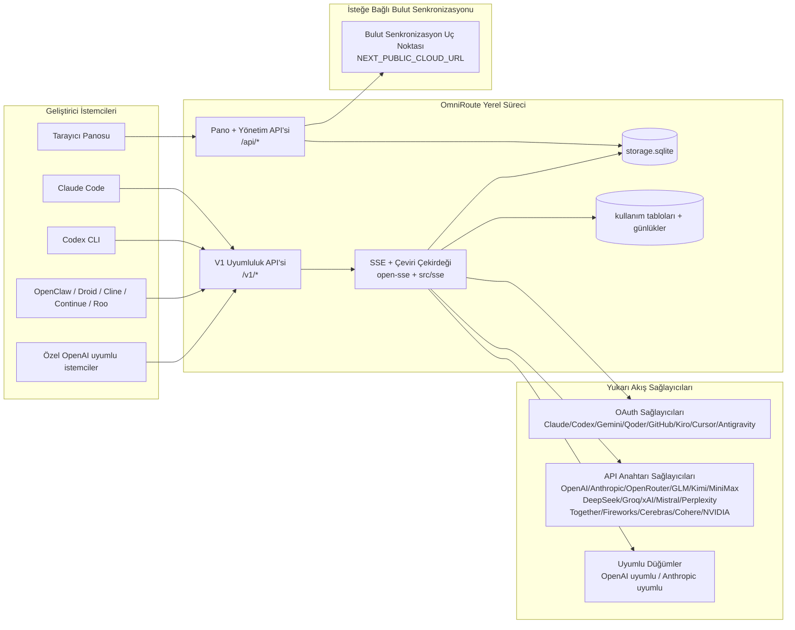

# OmniRoute Mimarisi (Türkçe)

🌐 **Languages:** 🇺🇸 [English](../../../../architecture/ARCHITECTURE.md) · 🇸🇦 [ar](../../../ar/docs/architecture/ARCHITECTURE.md) · 🇦🇿 [az](../../../az/docs/architecture/ARCHITECTURE.md) · 🇧🇬 [bg](../../../bg/docs/architecture/ARCHITECTURE.md) · 🇧🇩 [bn](../../../bn/docs/architecture/ARCHITECTURE.md) · 🇨🇿 [cs](../../../cs/docs/architecture/ARCHITECTURE.md) · 🇩🇰 [da](../../../da/docs/architecture/ARCHITECTURE.md) · 🇩🇪 [de](../../../de/docs/architecture/ARCHITECTURE.md) · 🇪🇸 [es](../../../es/docs/architecture/ARCHITECTURE.md) · 🇮🇷 [fa](../../../fa/docs/architecture/ARCHITECTURE.md) · 🇫🇮 [fi](../../../fi/docs/architecture/ARCHITECTURE.md) · 🇫🇷 [fr](../../../fr/docs/architecture/ARCHITECTURE.md) · 🇮🇳 [gu](../../../gu/docs/architecture/ARCHITECTURE.md) · 🇮🇱 [he](../../../he/docs/architecture/ARCHITECTURE.md) · 🇮🇳 [hi](../../../hi/docs/architecture/ARCHITECTURE.md) · 🇭🇺 [hu](../../../hu/docs/architecture/ARCHITECTURE.md) · 🇮🇩 [id](../../../id/docs/architecture/ARCHITECTURE.md) · 🇮🇹 [it](../../../it/docs/architecture/ARCHITECTURE.md) · 🇯🇵 [ja](../../../ja/docs/architecture/ARCHITECTURE.md) · 🇰🇷 [ko](../../../ko/docs/architecture/ARCHITECTURE.md) · 🇮🇳 [mr](../../../mr/docs/architecture/ARCHITECTURE.md) · 🇲🇾 [ms](../../../ms/docs/architecture/ARCHITECTURE.md) · 🇳🇱 [nl](../../../nl/docs/architecture/ARCHITECTURE.md) · 🇳🇴 [no](../../../no/docs/architecture/ARCHITECTURE.md) · 🇵🇭 [phi](../../../phi/docs/architecture/ARCHITECTURE.md) · 🇵🇱 [pl](../../../pl/docs/architecture/ARCHITECTURE.md) · 🇵🇹 [pt](../../../pt/docs/architecture/ARCHITECTURE.md) · 🇧🇷 [pt-BR](../../../pt-BR/docs/architecture/ARCHITECTURE.md) · 🇷🇴 [ro](../../../ro/docs/architecture/ARCHITECTURE.md) · 🇷🇺 [ru](../../../ru/docs/architecture/ARCHITECTURE.md) · 🇸🇰 [sk](../../../sk/docs/architecture/ARCHITECTURE.md) · 🇸🇪 [sv](../../../sv/docs/architecture/ARCHITECTURE.md) · 🇰🇪 [sw](../../../sw/docs/architecture/ARCHITECTURE.md) · 🇮🇳 [ta](../../../ta/docs/architecture/ARCHITECTURE.md) · 🇮🇳 [te](../../../te/docs/architecture/ARCHITECTURE.md) · 🇹🇭 [th](../../../th/docs/architecture/ARCHITECTURE.md) · 🇺🇦 [uk-UA](../../../uk-UA/docs/architecture/ARCHITECTURE.md) · 🇵🇰 [ur](../../../ur/docs/architecture/ARCHITECTURE.md) · 🇻🇳 [vi](../../../vi/docs/architecture/ARCHITECTURE.md) · 🇨🇳 [zh-CN](../../../zh-CN/docs/architecture/ARCHITECTURE.md) · 🇹🇼 [zh-TW](../../../zh-TW/docs/architecture/ARCHITECTURE.md)

---

_Son güncelleme: 2026-08-23_

## Yönetici Özeti

OmniRoute, Next.js üzerine inşa edilmiş yerel bir yapay zeka yönlendirme ağ geçidi (AI routing gateway) ve yönetim panosudur.
Tek bir OpenAI uyumlu uç nokta (`/v1/*`) sunar ve trafiği format dönüşümü, geri dönüş (fallback), belirteç yenileme ve kullanım takibi ile birden çok yukarı akış sağlayıcısına yönlendirir.

Temel yetenekler:

- CLI/araçlar için OpenAI uyumlu API yüzeyi (349 sağlayıcı, 101 yürütücü modülü)
- Sağlayıcı formatları arasında istek/yanıt çevirisi
- Model kombo geri dönüşü (çoklu model sırası)
- `compositeTiers` ile çalışma zamanı sıralamasına sahip yapılandırılmış kombo adımları (`provider + model + connection`)
- Hesap düzeyinde geri dönüş (sağlayıcı başına çoklu hesap)
- Ana sohbet yolunda kota ön kontrolü ve kota duyarlı P2C hesap seçimi
- OAuth + API anahtarı sağlayıcı bağlantı yönetimi (23 OAuth sağlayıcı modülü)
- `/v1/embeddings` üzerinden embedding üretimi (6 sağlayıcı, 9 model)
- `/v1/images/generations` üzerinden görsel üretimi (10+ sağlayıcı, 20+ model)
- `/v1/audio/transcriptions` üzerinden ses deşifresi (7 sağlayıcı)
- `/v1/audio/speech` üzerinden metinden sese (10 sağlayıcı)
- `/v1/videos/generations` üzerinden video üretimi (ComfyUI + SD WebUI)
- `/v1/music/generations` üzerinden müzik üretimi (ComfyUI)
- `/v1/search` üzerinden web araması (5 sağlayıcı)
- `/v1/moderations` üzerinden içerik denetimi
- `/v1/rerank` üzerinden yeniden sıralama
- Akıl yürütme modelleri için düşünme etiketi ayrıştırması (`<think>...</think>`)
- Katı OpenAI SDK uyumluluğu için yanıt temizleme
- Çapraz sağlayıcı uyumluluğu için rol normalizasyonu (developer→system, system→user)
- Yapılandırılmış çıktı dönüştürme (json_schema → Gemini responseSchema)
- Sağlayıcılar, anahtarlar, takma adlar, kombolar, ayarlar, fiyatlandırma için yerel kalıcılık (120 DB modülü)
- Kullanım/maliyet takibi ve istek kaydı
- Çoklu cihaz/durum senkronizasyonu için isteğe bağlı bulut senkronizasyonu
- API erişim kontrolü için IP izin listesi / engelleme listesi
- Düşünme bütçesi yönetimi (passthrough/auto/custom/adaptive)
- Genel sistem istemi (system prompt) enjeksiyonu
- Oturum takibi ve parmak izi oluşturma
- Sağlayıcıya özel profillerle hesap başına gelişmiş hız sınırlaması
- Sağlayıcı dayanıklılığı için devre kesici (circuit breaker) modeli
- Mutex kilitleme ile sürü önleme koruması (anti-thundering herd)
- İmza tabanlı istek tekilleştirme önbelleği
- Alan katmanı: maliyet kuralları, geri dönüş politikası, kilitleme politikası
- Context Relay: hesap rotasyonunda oturum sürekliliği için devir özetleri
- Alan durumu kalıcılığı (geri dönüşler, bütçeler, kilitlemeler, devre kesiciler için SQLite doğrudan yazma önbelleği)
- Merkezi istek değerlendirmesi için politika motoru (kilitleme → bütçe → geri dönüş)
- p50/p95/p99 gecikme toplama ile istek telemetrisi
- `combo_execution_key` / `combo_step_id` aracılığıyla kombo hedef telemetrisi ve geçmiş sağlık durumu
- Uçtan uca izleme için korelasyon kimliği (X-Request-Id)
- API anahtarı başına vazgeçme seçeneğiyle uyumluluk denetim kaydı
- LLM kalite güvencesi için değerlendirme (eval) çerçevesi
- Gerçek zamanlı sağlayıcı devre kesici durumu içeren sağlık panosu
- 3 taşıma protokolüne (stdio/SSE/Streamable HTTP) sahip MCP Sunucusu (110 araç)
- Yetenekler ve görev yaşam döngüsüne sahip A2A Sunucusu (JSON-RPC 2.0 + SSE)
- Bellek sistemi (çıkarma, enjeksiyon, getirme, özetleme)
- Yetenekler sistemi (kayıt defteri, yürütücü, korumalı alan, yerleşik yetenekler)
- Sertifika yönetimi ve DNS işleme özellikli MITM proxy
- İstem enjeksiyonu koruma ara yazılımı
- Caveman, RTK, katmanlı işlem hatları, sıkıştırma komboları, dil paketleri ve analitik içeren istem sıkıştırma hattı
- ACP (Agent Communication Protocol) kayıt defteri
- Modüler OAuth sağlayıcıları (`src/lib/oauth/providers/` altında 23 ayrı modül)
- Kaldırma / tam kaldırma betikleri
- OAuth ortam onarım eylemi
- OpenAI uyumlu WS istemcileri için WebSocket köprüsü (`/v1/ws`)
- Senkronizasyon belirteci yönetimi (oluşturma/iptal etme, ETag sürümlü yapılandırma paketi indirme)
- GLM Thinking (`glmt`) birinci sınıf sağlayıcı önayarı
- Hibrit token sayımı (tahmin geri dönüşü ile sağlayıcı tarafı `/messages/count_tokens`)
- Model takma adı otomatik tohumlama (başlangıçta 30'dan fazla proxy arası diyalekt normalizasyonu)
- SSRF koruması, özel URL engelleme ve yapılandırılabilir yeniden deneme ile güvenli giden çağrılar
- Yapılandırılabilir `requestRetry` ve `maxRetryIntervalSec` ile soğuma duyarlı sohbet yeniden denemeleri
- Başlangıçta Zod ile çalışma zamanı ortam doğrulaması
- Sayfalama, sağlayıcı CRUD olayları ve SSRF engelleme doğrulama günlüğü içeren uyumluluk denetimi v2

Birincil çalışma zamanı modeli:

- `src/app/api/*` altındaki Next.js uygulama rotaları hem pano API'lerini hem de uyumluluk API'lerini uygular
- `src/sse/*` + `open-sse/*` içindeki paylaşılan SSE/yönlendirme çekirdeği; sağlayıcı yürütme, çeviri, akış, geri dönüş ve kullanım işlemlerini yönetir

## Referans Diyagramları

Platformun Mermaid diyagram kaynakları [`docs/diagrams/`](docs/diagrams/README.md) dizininde yer almaktadır.

> Kaynak: [diagrams/request-pipeline.mmd](docs/diagrams/request-pipeline.mmd)

> Kaynak: [diagrams/resilience-3layers.mmd](docs/diagrams/resilience-3layers.mmd) — ayrıca [RESILIENCE_GUIDE.md](docs/architecture/RESILIENCE_GUIDE.md) belgesinde yer almaktadır.

---

## Kapsam ve Sınırlar

### Kapsam Dahilinde Olanlar

- Yerel ağ geçidi çalışma zamanı
- Pano yönetim API'leri
- Sağlayıcı kimlik doğrulaması ve belirteç yenileme
- İstek çevirisi ve SSE akışı
- Yerel durum + kullanım kalıcılığı
- İsteğe bağlı bulut senkronizasyon orkestrasyonu

### Kapsam Dışında Olanlar

- `NEXT_PUBLIC_CLOUD_URL` arkasındaki bulut hizmeti uygulaması
- Yerel sürecin dışındaki sağlayıcı SLA/kontrol düzlemi
- Harici CLI ikili dosyalarının kendileri (Claude CLI, Codex CLI vb.)

---

## Pano Yüzeyi (Dashboard Surface)

`src/app/(dashboard)/dashboard/` altındaki ana sayfalar:

- `/dashboard` — hızlı başlangıç + sağlayıcı genel bakışı
- `/dashboard/endpoint` — uç nokta proxy + MCP + A2A + API uç noktaları sekmeleri
- `/dashboard/providers` — sağlayıcı bağlantıları ve kimlik bilgileri
- `/dashboard/combos` — kombo stratejileri, şablonlar, adım tabanlı oluşturucu, model yönlendirme kuralları, manuel kalıcı sıralama
- `/dashboard/auto-combo` — Auto Combo Motoru: puanlama ağırlıkları, mod paketleri, sanal fabrika önayarları, teleometri
- `/dashboard/costs` — maliyet toplama ve fiyatlandırma görünürlüğü
- `/dashboard/analytics` — kullanım analitiği, değerlendirmeler, kombo hedef sağlığı
- `/dashboard/limits` — kota/hız denetimleri
- `/dashboard/cli-tools` — CLI yapılandırma, çalışma zamanı algılama, yapılandırma üretimi
- `/dashboard/agents` — algılanan ACP ajanları + özel ajan kaydı
- `/dashboard/cloud-agents` — bulut tabanlı ajan görevleri (Codex Cloud, Devin, Jules) ve görev yaşam döngüsü
- `/dashboard/skills` — A2A yetenek kayıt defteri, korumalı alan yürütme, yerleşik yetenek kataloğu
- `/dashboard/memory` — kalıcı konuşma belleği inceleme ve getirme
- `/dashboard/webhooks` — giden webhook abonelikleri, sır rotasyonu, yeniden deneme istatistikleri
- `/dashboard/batch` — toplu iş gönderimi ve ilerleme durumu
- `/dashboard/cache` — doğrudan okuma ve akıl yürütme önbelleği istatistikleri, temizleme denetimleri
- `/dashboard/playground` — yapılandırılmış herhangi bir kombo/modele karşı etkileşimli sohbet alanı
- `/dashboard/changelog` — uygulama içi değişiklik günlüğü görüntüleyici (`CHANGELOG.md` içeriğini işler)
- `/dashboard/system` — çalışma zamanı tanılamaları, sürüm bilgisi, ortam doğrulama yüzeyi
- `/dashboard/onboarding` — yeni kurulumlar için ilk çalıştırma sihirbazı
- `/dashboard/media` — görsel/video/müzik oyun alanı
- `/dashboard/search-tools` — arama sağlayıcısı testi ve geçmişi
- `/dashboard/health` — çalışma süresi, devre kesiciler, hız sınırları, kota izlenen oturumlar
- `/dashboard/logs` — istek/proxy/denetim/konsol günlükleri
- `/dashboard/settings` — sistem ayarları sekmeleri (genel, yönlendirme, kombo varsayılanları vb.)
- `/dashboard/context/caveman` — Caveman sıkıştırma kuralları, dil paketleri, önizleme ve çıktı modu
- `/dashboard/context/rtk` — RTK komut çıktısı filtreleri, önizleme ve çalışma zamanı güvenlik ayarları
- `/dashboard/context/combos` — yönlendirme kombolarına atanan adlandırılmış sıkıştırma hatları
- `/dashboard/translator` — çevirmen inceleme ve istek formatı dönüştürme önizlemesi
- `/dashboard/audit` — sayfalama ve yapılandırılmış meta veriler içeren uyumluluk denetim günlüğü tarayıcısı
- `/dashboard/usage` — `usage_history` tablosuna bağlı istek başına kullanım tarayıcısı
- `/dashboard/compression` — sıkıştırma analitiği, istatistikler ve işlem hattı ataması
- `/dashboard/api-manager` — API anahtarı yaşam döngüsü ve model izinleri

---

## Yüksek Düzey Sistem Bağlamı

---

## Çekirdek Çalışma Zamanı Bileşenleri

### 1) API ve Yönlendirme Katmanı (Next.js App Router)

Ana dizinler:

- Uyumluluk API'leri için `src/app/api/v1/*` ve `src/app/api/v1beta/*`
- Yönetim/yapılandırma API'leri için `src/app/api/*`
- `next.config.mjs` içindeki yönlendirmeler `/v1/*` yollarını `/api/v1/*` rotalarına eşler

Önemli uyumluluk rotaları:

- `src/app/api/v1/chat/completions/route.ts`
- `src/app/api/v1/messages/route.ts`
- `src/app/api/v1/responses/route.ts`
- `src/app/api/v1/models/route.ts` — `custom: true` içeren özel modelleri de kapsar
- `src/app/api/v1/embeddings/route.ts` — embedding üretimi (6 sağlayıcı)
- `src/app/api/v1/images/generations/route.ts` — görsel üretimi (10+ sağlayıcı)
- `src/app/api/v1/messages/count_tokens/route.ts`
- `src/app/api/v1/providers/[provider]/chat/completions/route.ts` — özel sağlayıcı sohbet rotası
- `src/app/api/v1/providers/[provider]/embeddings/route.ts` — özel sağlayıcı embedding rotası
- `src/app/api/v1/providers/[provider]/images/generations/route.ts` — özel sağlayıcı görsel rotası
- `src/app/api/v1beta/models/route.ts`
- `src/app/api/v1beta/models/[...path]/route.ts`

Yönetim alanları:

- Kimlik doğrulama/ayarlar: `src/app/api/auth/*`, `src/app/api/settings/*`
- Sağlayıcılar/bağlantılar: `src/app/api/providers*`
- Sağlayıcı düğümleri: `src/app/api/provider-nodes*`
- Özel modeller: `src/app/api/provider-models` (GET/POST/DELETE)
- Model kataloğu: `src/app/api/models/route.ts` (GET)
- Proxy yapılandırması: `src/app/api/settings/proxy` (GET/PUT/DELETE) + `src/app/api/settings/proxy/test` (POST)
- OAuth: `src/app/api/oauth/*`
- Anahtarlar/takma adlar/kombolar/fiyatlandırma: `src/app/api/keys*`, `src/app/api/models/alias`, `src/app/api/combos*`, `src/app/api/pricing`
- Kullanım: `src/app/api/usage/*`
- Senkronizasyon/bulut: `src/app/api/sync/*`, `src/app/api/cloud/*`
- CLI araç yardımcıları: `src/app/api/cli-tools/*`
- IP filtresi: `src/app/api/settings/ip-filter` (GET/PUT)
- Düşünme bütçesi: `src/app/api/settings/thinking-budget` (GET/PUT)
- Sistem istemi: `src/app/api/settings/system-prompt` (GET/PUT)
- Sıkıştırma: `src/app/api/settings/compression`, `src/app/api/compression/*`, `src/app/api/context/*`
- Oturumlar: `src/app/api/sessions` (GET)
- Hız sınırları: `src/app/api/rate-limits` (GET)
- Dayanıklılık: `src/app/api/resilience` (GET/PATCH)
- Dayanıklılık sıfırlama: `src/app/api/resilience/reset` (POST)
- Önbellek istatistikleri: `src/app/api/cache/stats` (GET/DELETE)
- Telemetri: `src/app/api/telemetry/summary` (GET)
- Bütçe: `src/app/api/usage/budget` (GET/POST)
- Geri dönüş zincirleri: `src/app/api/fallback/chains` (GET/POST/DELETE)
- Uyumluluk denetimi: `src/app/api/compliance/audit-log` (GET)
- Değerlendirmeler: `src/app/api/evals` (GET/POST), `src/app/api/evals/[suiteId]` (GET)
- Politikalar: `src/app/api/policies` (GET/POST)
- Senkronizasyon belirteçleri: `src/app/api/sync/tokens` (GET/POST), `src/app/api/sync/tokens/[id]` (GET/DELETE)
- Yapılandırma paketi: `src/app/api/sync/bundle` (GET)
- WebSocket: `src/app/api/v1/ws/route.ts`

### 2) SSE ve Çeviri Çekirdeği

Ana akış modülleri:

- Giriş: `src/sse/handlers/chat.ts`
- Çekirdek orkestrasyon: `open-sse/handlers/chatCore.ts`
- Sağlayıcı yürütme bağdaştırıcıları: `open-sse/executors/*`
- Format algılama/sağlayıcı yapılandırması: `open-sse/services/provider.ts`
- Model ayrıştırma/çözümleme: `src/sse/services/model.ts`, `open-sse/services/model.ts`
- Hesap geri dönüş mantığı: `open-sse/services/accountFallback.ts`
- Çeviri kayıt defteri: `open-sse/translator/index.ts`
- Akış dönüşümleri: `open-sse/utils/stream.ts`, `open-sse/utils/streamHandler.ts`
- Kullanım çıkarma/normalizasyonu: `open-sse/utils/usageTracking.ts`
- Düşünme etiketi ayrıştırıcısı: `open-sse/utils/thinkTagParser.ts`
- Embedding işleyicisi: `open-sse/handlers/embeddings.ts`
- Görsel üretimi işleyicisi: `open-sse/handlers/imageGeneration.ts`
- Yanıt temizleme: `open-sse/handlers/responseSanitizer.ts`
- Rol normalizasyonu: `open-sse/services/roleNormalizer.ts`

Servisler (İş Mantığı):

- Hesap seçimi/puanlaması: `open-sse/services/accountSelector.ts`
- Bağlam yaşam döngüsü yönetimi: `open-sse/services/contextManager.ts`
- IP filtre denetimi: `open-sse/services/ipFilter.ts`
- Oturum takibi: `open-sse/services/sessionManager.ts`
- İstek tekilleştirme: `open-sse/services/signatureCache.ts`
- Sistem istemi enjeksiyonu: `open-sse/services/systemPrompt.ts`
- Düşünme bütçesi yönetimi: `open-sse/services/thinkingBudget.ts`
- Joker model yönlendirmesi: `open-sse/services/wildcardRouter.ts`
- Hız sınırı yönetimi: `open-sse/services/rateLimitManager.ts`
- Devre kesici: `src/shared/utils/circuitBreaker.ts`
- Context handoff: `open-sse/services/contextHandoff.ts`
- Sıkıştırma motorları: `open-sse/services/compression/*`
- Soğuma duyarlı yeniden deneme: `src/sse/services/cooldownAwareRetry.ts`

---

## 3) Veritabanı ve Kalıcılık Mimarisi

OmniRoute, **SQLite** (better-sqlite3) ve **WAL (Write-Ahead Logging)** günlük kaydı kullanır:

- Çekirdek veritabanı tekili: `src/lib/db/core.ts` (`getDbInstance()`)
- Alan modülleri: `src/lib/db/` altında 120 modül (providers, combos, apiKeys, settings vb.)
- Migrasyonlar: `src/lib/db/migrations/` altında 159 sürüm kontrollü SQL dosyası
- `localDb.ts` katmanı: Yalnızca yeniden dışa aktarma (re-export) katmanıdır, asla doğrudan mantık içermez

---

## 4) Güvenlik ve Yetkilendirme

- **Yetkilendirme Hattı:** İstekler `PUBLIC`, `CLIENT_API`, `MANAGEMENT` olarak sınıflandırılır.
- **Dinlenmede Şifreleme:** AES-256-GCM ile scrypt anahtar türetme (`src/lib/db/encryption.ts`).
- **Güvenlik Önlemleri (Guardrails):** `vision-bridge` (5), `pii-masker` (10), `prompt-injection` (20) öncelik sırasıyla yürütülür.
- **SSRF Koruması:** Giden tüm URL isteklerinde özel IP'ler ve iç ağlar engellenir.

---

## 5) Dayanıklılık Modeli (3 Bağımsız Katman)

1. **Sağlayıcı Devre Kesici (Whole Provider):** Yalnızca 408/5xx durumlarında tetiklenir (OAuth: 10, API Key: 15, Local: 2 başarısızlık eşiği).
2. **Bağlantı Bekleme/Soğuma Süresi (One Connection):** 429 veya geçici hatalarda tek bir hesabı/anahtarı bekletir, kardeş anahtarlar hizmet vermeye devam eder.
3. **Model Kilitleme (One Model):** Belirli bir model kotası bittiğinde veya model bulunamadığında yalnızca o modeli kilitler.

---

## 6) İstem Sıkıştırma İşlem Hattı (12 Motor)

İstekler sağlayıcıya iletilmeden önce 12 aşamalı sıkıştırma hattından geçebilir:

1. **Session-Dedup** → 2. **CCR** → 3. **Lite** → 4. **RTK** → 5. **Responses Tool Output** → 6. **Headroom (GCF)** → 7. **Relevance** → 8. **Caveman** → 9. **Aggressive** → 10. **LLMLingua-2** → 11. **Ultra** → 12. **OmniGlyph**

---

## 7) Protokoller: MCP, A2A ve ACP

- **MCP Sunucusu (`open-sse/mcp-server/`):** 110 araç, 33 kapsam, 3 taşıma modu (stdio, SSE, Streamable HTTP).
- **A2A Sunucusu (`src/lib/a2a/`):** JSON-RPC 2.0 + SSE, 6 yetenek (`smart-routing`, `quota-management`, `provider-discovery`, `cost-analysis`, `health-report`, `list-capabilities`).
- **ACP Kayıt Defteri (`src/lib/acp/`):** Kodlama CLI araçları ve özerk ajanlar için iletişim ve durum yönetimi.
